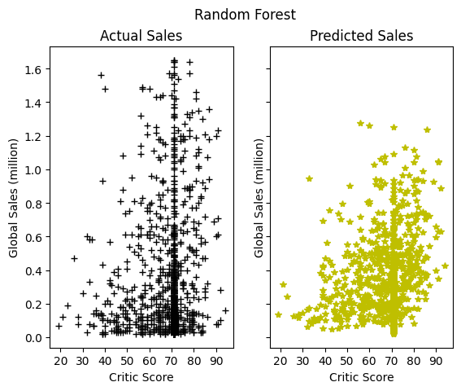
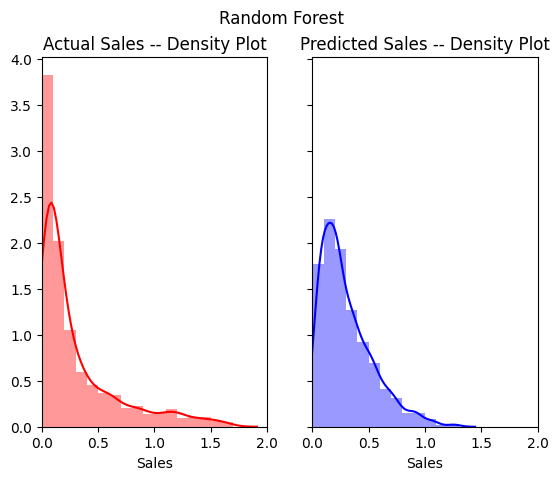

# Workflow

This documentation describes the workflow of the project.

## Preprocessing

Because the dataset given is missing data, we preprocess the data first and save the result in a SQLite Database. Below are the steps we have taken to preprocess the data.

1. Remove the rows containing missing data that cannot be imputed. (`Platform, Genre, Publisher, Year_of_Release`)

2. Replace the missing values with the median of the column. (`Critic Score, User Score, Critic Count, User Count`)

3. Replace categorical data with dummy variables (one-hot-encoding) (`Genre, Publisher`) and drop one column of each to decorrelate the columns.

## Modeling

In the Python code, we use **Random Forest** and **KNN** as our regression models. See [models.py](../models.py) for more information about the implementation.

1. Random Forest: We set the criterion to be MSE to minimize the mean square error.

2. KNN: For the K-nearest neighbors, we split the data into three pieces:
   1. **Training**: the data we use to train the model.
   2. **Cross Validation**: the data we use to determine the number of neighbors we use in the model (Choose the **k** to minimize the root mean square error)
   3. **Test**: the data we use to test the model.

## Plotting

The code generates two kinds of plots for each model when they are applied to the test set. See [plotting.py](../plotting.py) for more information about the actual implementation.

1. **Global Sales vs Critic Score**: This is actually misleading because we use parameters besides critic score to predict global sales. Below is such a plot for Random Forest.

    

2. **Kernel Density Distribution**: It plots a kernel density estimate for both the actual sales and the predicted sales. below is such a plot for Random Forest. The Gaussian kernel is chosen by default for the kernel density estimate. For more information about the plot, see [here](https://seaborn.pydata.org/generated/seaborn.kdeplot.html#seaborn.kdeplot).

    

    The more similar the two probability density curves are, the better the model predicts.